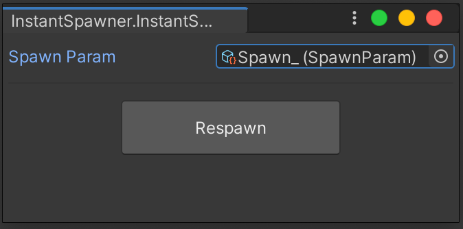

# instant-spawner

- 動作確認環境
  - Unity 2019.4.11
  - ClusterCreatorKit v1.11.0 

## 機能

- Prefab を用いて Hierarchy へ Instance 生成
- ScriptableObject で設定を保存
  - Position
  - Rotation
  - Main Texture
- 置換用Materialを自動生成
  - `Assets/TempMaterial` に保存（実行毎にリフレッシュ）

## 利用方法

### プロジェクトへパッケージの追加

Unity の `Package Manager` から追加します。

1. `+` アイコンをクリック
2. `Add package from git URL...` をクリック
3. `git@github.com:kumak1/instant-spawner.git` を入力

### 設定ファイルの用意

1. `Project` ウィンドウで右クリック
2. `Create` > `Tools` > `SpawnParam` をクリック

3. 各項目に設定を追記

### 実行ウィンドウの操作

1. ツールバー `Tools` > `Instant Spawner` をクリック

2. `Spawn Param` に作成した設定ファイルを割当
3. `Respawn` ボタンを押下

